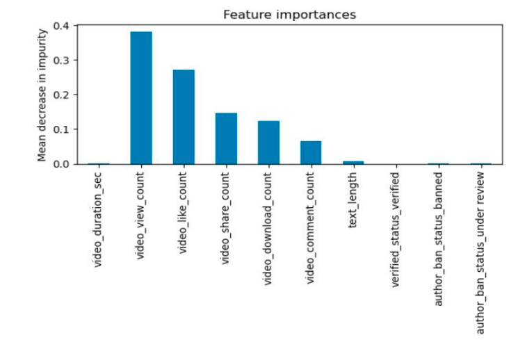

# Random forest and logistic regression on the classification of TikTok videos 
Used statsmodels and scikit-learn to predict whether videos presented claims or opinions to improve triaging process of videos for human review.

## overview
In this project, I developed machine learning models to classify user submission claims using TikTok data. The project involved multiple stages, each encompassing various tasks such as Exploratory Data Analysis (EDA) and A/B testing. Initially, I explored different modeling approaches, including logistic regression, to understand the data better.

After thorough analysis, I decided to implement advanced machine learning models. Specifically, I developed a Random Forest model and an XGBoost model. Through comparative evaluation, I determined that the Random Forest model was the most effective, given its assumptions and compatibility with the data.

The final Random Forest model demonstrated outstanding performance, achieving an impressive F1 score of 0.99, indicating its robustness and accuracy in classifying claims.

## Business Understanding 
TikTok users have the ability to submit reports that identify videos and comments that contain user claims. These reports identify content that needs to be reviewed by moderators. The process generates a large number of user reports that are challenging to consider in a timely manner. This means that moderators have a large number of videos to be checked. Develop a model able to predict whether a video is a claim or an opinion; it's a solution that can save time and money for Tik Tok's moderators. 

## Data Understanding
The Tik Tok data came from [coursera.org](https://www.coursera.org/). The data consisted of approximately 19k videos and 11 features. The features included information on counts of views, comments, and shares, the video's status (it was considered a claim or an opinion), the user's verification status, and the video's transcription text.

## Modeling and Evaluation 
A random forest model comprising 75 decision trees was used to determine feature importance in determining whether a video is a claim or an opinion. The below plot shows that video's views count, video's like count, and video's share count were the top 3 most important factors in determining a possible claim video. The overall model performed with 99% accuracy and 99% precision. 

## Conclusion
This model can benefit Tik Tok moderators, saving them time classicizing the platform's videos. In the future, I suggest adding more user information because the video's nature is closely related to its creator's nature. In this way, moderators are going to be able to recognize troublemakers and pay more attention to them. 

